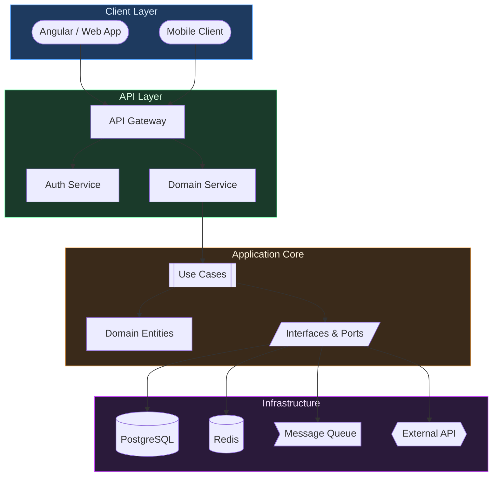
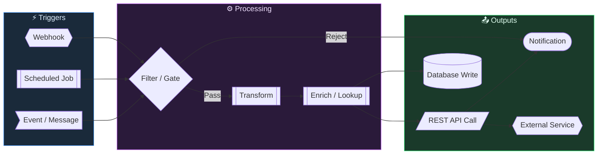
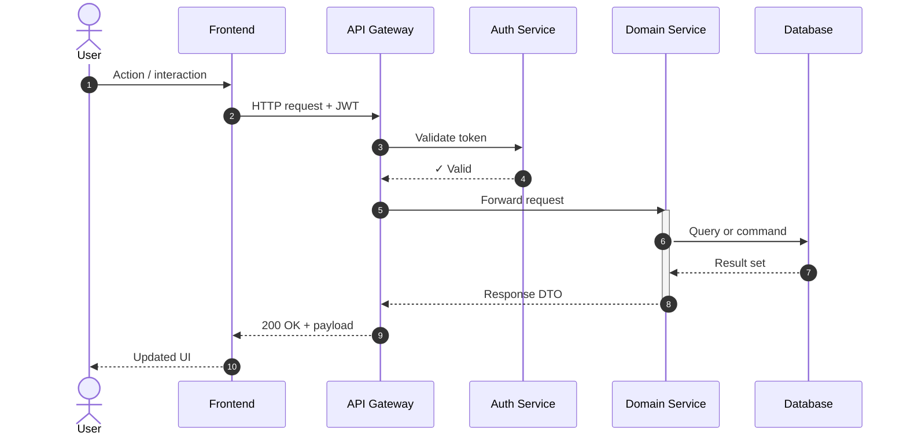
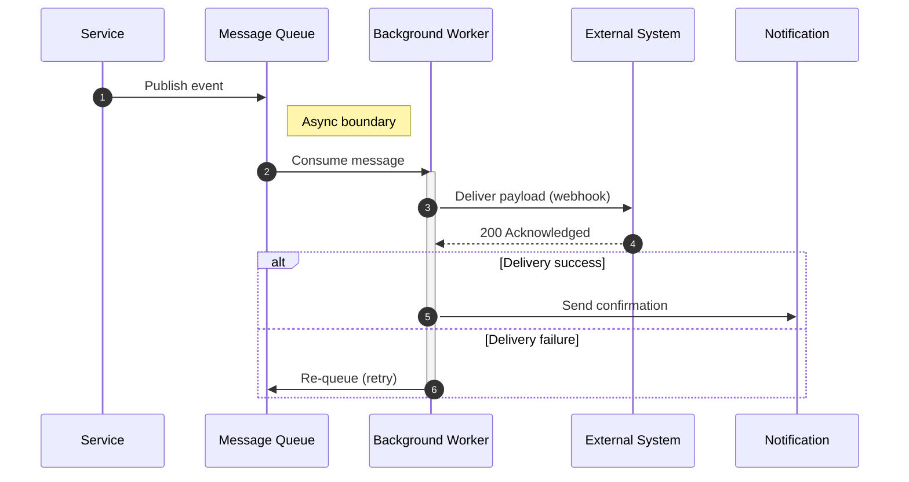
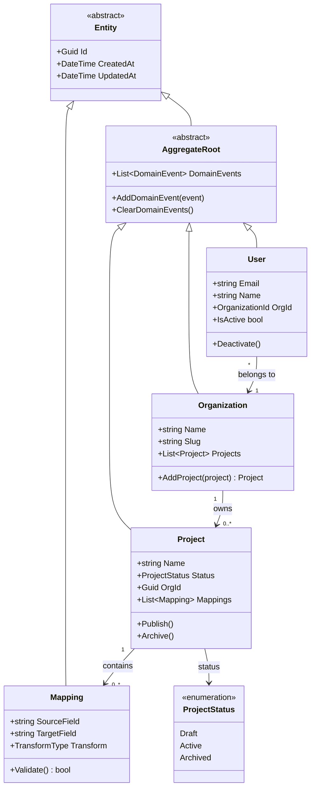
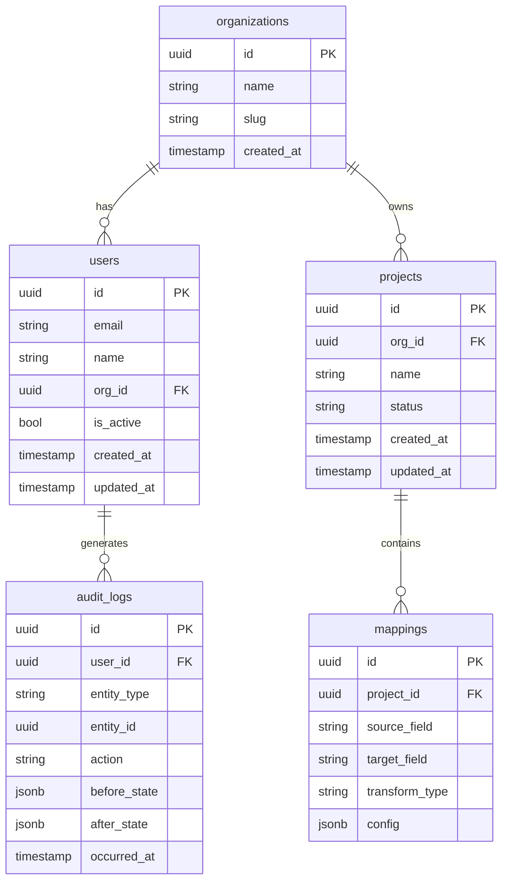

# Architecture Diagram Templates

A library of starter templates for architecture diagrams in Obsidian.
Copy a template, drop it into a note, and customize from there.

-----

## Index

### 🟦 Flowcharts (Mermaid)

- [Flowchart — System Overview](#flowchart--system-overview) — Layered architecture, Clean Architecture style
- [Flowchart — Event / Integration Pipeline](#flowchart--event--integration-pipeline) — n8n, webhooks, automation flows

### 🟩 Sequence Diagrams (Mermaid)

- [Sequence — Request Lifecycle](#sequence-diagram--request-lifecycle) — Standard HTTP request through layered API
- [Sequence — Webhook / Async Flow](#sequence-diagram--webhook--async-flow) — Event publishing, background workers, retry logic
- [Sequence — Snippet Kit](#useful-additions) — Conditionals, loops, annotations, highlights

### 🟨 Class & Data Diagrams (Mermaid)

- [Class Diagram — Domain Model](#class-diagram--domain-model) — Clean Architecture entities, aggregates, enums
- [ERD — Database Schema](#erd--database-schema) — Table-level schema with PKs, FKs, types

### 🟥 Architecture & Infrastructure (D2)

- [D2 — System Architecture](#d2--system-architecture-clean-architecture) — Clean Architecture layers with auto-layout
- [D2 — Infrastructure / Homelab](#d2--infrastructure--homelab) — Proxmox, VMs, LXC containers, storage
- [D2 — C4 Context Diagram](#d2--c4-context-diagram) — System boundary, actors, external systems
- [D2 — C4 Container Diagram](#d2--c4-container-diagram) — Internal containers, drill-down from context

### 📦 Reference

- [Obsidian Note Wrapper](#obsidian-note-wrapper) — Frontmatter + callout template
- [Shape Reference — Mermaid](#shape-reference-mermaid)
- [Shape Reference — D2](#shape-reference-d2)
- [Color Palette](#color-palette-dark-mode)

-----

## Tool Reference

|Tool       |Best For                                 |Obsidian Support               |
|-----------|-----------------------------------------|-------------------------------|
|**Mermaid**|Sequence, ERD, class diagrams, flowcharts|Native (built-in)              |
|**D2**     |System architecture, infrastructure, C4  |Plugin required (`d2-obsidian`)|

-----

## D2 Installation

D2 is a Go binary — install it once, then the Obsidian plugin picks it up automatically.

### Arch Linux / Omarchy

```bash
yay -S d2
```

### macOS

```bash
# Homebrew
brew install d2

# Or the official install script
curl -fsSL https://d2lang.com/install.sh | sh
```

### Windows

```powershell
# Scoop
scoop install d2

# Or Winget
winget install terrastruct.d2
```

### Ubuntu / Debian

```bash
# Official install script (installs to /usr/local/bin)
curl -fsSL https://d2lang.com/install.sh | sh

# Or grab a .deb from releases
# https://github.com/terrastruct/d2/releases
```

### Any platform — direct binary

Download the latest release for your platform from:
https://github.com/terrastruct/d2/releases

Extract and place the `d2` binary somewhere on your `$PATH`.

### Verify install

```bash
d2 --version
```

### Obsidian plugin setup

1. Open Obsidian → Settings → Community Plugins → Browse
1. Search **D2** → Install → Enable
1. In plugin settings, set the D2 binary path if not auto-detected (usually `/usr/bin/d2` or `/usr/local/bin/d2`)
1. Use ````d2` fenced blocks in any note — diagrams render inline

-----

## Mermaid Templates

### Flowchart — System Overview

A general-purpose layered system diagram. Good starting point for any service.



**Layer color key:**

- 🔵 Blue — Client / Presentation
- 🟢 Green — API / Application
- 🟡 Amber — Domain / Core
- 🟣 Purple — Infrastructure / Data

-----

### Flowchart — Event / Integration Pipeline

For n8n workflows, webhooks, automation, or any event-driven flow.
Direction is LR (left-right) since pipelines read naturally that way.



-----

### Sequence Diagram — Request Lifecycle

Standard request flow through a layered API. Swap actor/participant names as needed.



**Useful additions:**

```mermaid
sequenceDiagram
    %% Conditional branch
    alt Token valid
        GW->>SVC: Forward request
    else Token expired
        GW-->>FE: 401 Unauthorized
    end

    %% Loop
    loop Retry (max 3)
        SVC->>EXT: Call external API
    end

    %% Annotation
    Note over SVC: Business logic / validation here

    %% Highlight a section
    rect rgb(30, 50, 30)
        SVC->>DB: Critical transaction
        DB-->>SVC: Commit ✓
    end
```



-----

### Sequence Diagram — Webhook / Async Flow

For outbound webhooks, event publishing, or async processing patterns.



-----

### Class Diagram — Domain Model

For Clean Architecture domain layers, EF Core models, or any OOP structure.



-----

### ERD — Database Schema

For database design, EF Core schema review, or data modeling.



-----

## D2 Templates

> These require the `d2-obsidian` plugin. Use ````d2` fenced blocks.
> D2 shines for architecture and infrastructure — auto-layout stays clean as diagrams grow.

### D2 — System Architecture (Clean Architecture)

```d2
direction: down

Client: {
  label: "Client Layer"
  style.fill: "#1e3a5f"
  style.stroke: "#4a9eff"

  Web: Angular App {shape: oval}
  Mobile: Mobile Client {shape: oval}
}

API: {
  label: "API Layer"
  style.fill: "#1a3a2a"
  style.stroke: "#4aff91"

  GW: API Gateway
  Auth: Auth Service
  Svc: Domain Service
}

Core: {
  label: "Application Core"
  style.fill: "#3a2a1a"
  style.stroke: "#ffaa4a"

  UC: Use Cases
  Domain: Domain Entities
  Ports: Ports & Interfaces {shape: hexagon}
}

Infra: {
  label: "Infrastructure"
  style.fill: "#2a1a3a"
  style.stroke: "#cc4aff"

  DB: PostgreSQL {shape: cylinder}
  Cache: Redis {shape: cylinder}
  Queue: Message Queue {shape: queue}
  Ext: External API {shape: cloud}
}

Client.Web -> API.GW
Client.Mobile -> API.GW
API.GW -> API.Auth
API.GW -> API.Svc
API.Svc -> Core.UC
Core.UC -> Core.Domain
Core.UC -> Core.Ports
Core.Ports -> Infra.DB
Core.Ports -> Infra.Cache
Core.Ports -> Infra.Queue
Core.Ports -> Infra.Ext
```

-----

### D2 — Infrastructure / Homelab

```d2
direction: down

internet: {
  label: "🌐 Internet"
  style.fill: "#1a1a2e"
  style.stroke: "#4a9eff"

  user: End User {shape: person}
  cf: Cloudflare {shape: cloud}
}

edge: {
  label: "Edge / Proxy"
  style.fill: "#1e2a1a"
  style.stroke: "#4aff70"

  proxy: Nginx Proxy Manager
  ssl: SSL Termination
}

proxmox: {
  label: "🖥️ Proxmox Host"
  style.fill: "#1e1a2e"
  style.stroke: "#9966ff"

  apps: {
    label: "VM: App Server"
    app: Application
    api: API Layer
  }

  data: {
    label: "VM: Data"
    pg: PostgreSQL {shape: cylinder}
    redis: Redis {shape: cylinder}
  }

  automation: {
    label: "VM: Automation"
    n8n: n8n
    ha: Home Assistant
  }

  containers: {
    label: "LXC Containers"
    dns: AdGuard DNS
    mon: Monitoring
  }
}

storage: {
  label: "💾 Storage"
  nas: NAS / NFS {shape: cylinder}
  backup: Backup Target {shape: cylinder}
}

internet.user -> internet.cf
internet.cf -> edge.proxy
edge.proxy -> edge.ssl
edge.ssl -> proxmox.apps.app
edge.ssl -> proxmox.automation.n8n
edge.ssl -> proxmox.automation.ha
proxmox.apps.app -> proxmox.data.pg
proxmox.apps.app -> proxmox.data.redis
proxmox.automation.n8n -> proxmox.automation.ha
proxmox.apps -> storage.nas
proxmox.data -> storage.nas
proxmox -> storage.backup
```

-----

### D2 — C4 Context Diagram

```d2
direction: right

vars: {
  d2-config: {
    layout-engine: elk
  }
}

system: {
  label: "System Boundary"
  style.stroke-dash: 5
  style.fill: "#0f1f2f"
  style.stroke: "#3399ff"

  core: Core Application
  api: Public API
  worker: Background Workers {shape: hexagon}
}

user: End User {shape: person}
admin: Admin {shape: person}
auth_ext: Auth Provider {shape: cloud}
payments: Payment Provider {shape: cloud}
email: Email Service {shape: cloud}

user -> system.core: Uses via browser
admin -> system.core: Manages via dashboard
system.core -> auth_ext: Authenticates via
system.core -> payments: Charges via
system.worker -> email: Sends via
system.api -> user: Webhooks to
```

-----

### D2 — C4 Container Diagram

Drill down into one system from the Context diagram above.

```d2
direction: down

vars: {
  d2-config: {
    layout-engine: elk
  }
}

boundary: {
  label: "Your System"
  style.stroke-dash: 5
  style.fill: "#0a0f1a"
  style.stroke: "#3399ff"

  spa: SPA / Frontend {
    shape: rectangle
    style.fill: "#1e3a5f"
    style.stroke: "#4a9eff"
  }

  api: API Application {
    shape: rectangle
    style.fill: "#1a3a2a"
    style.stroke: "#4aff91"
    label: "API Application\n.NET / Clean Architecture"
  }

  worker: Worker Service {
    shape: hexagon
    style.fill: "#2a1a3a"
    style.stroke: "#cc4aff"
    label: "Background Worker\nHosted Service"
  }

  db: Primary Database {
    shape: cylinder
    style.fill: "#2e1e1a"
    style.stroke: "#ff7044"
    label: "PostgreSQL\nvia EF Core"
  }

  cache: Cache {
    shape: cylinder
    style.fill: "#2e1e1a"
    style.stroke: "#ff7044"
    label: "Redis\nSession / Cache"
  }

  queue: Message Bus {
    shape: queue
    style.fill: "#1a1e2e"
    style.stroke: "#66aaff"
  }
}

user: User {shape: person}
ext: External Service {shape: cloud}

user -> boundary.spa: HTTPS
boundary.spa -> boundary.api: REST / JSON
boundary.api -> boundary.db: Reads / Writes
boundary.api -> boundary.cache: Cache ops
boundary.api -> boundary.queue: Publishes events
boundary.worker -> boundary.queue: Consumes events
boundary.worker -> ext: Calls
```

-----

## Obsidian Note Wrapper

Wrap any diagram above in this note template for a consistent vault experience:

```markdown
---
tags: [architecture, diagram, <type>]
project: <ProjectName>
created: <date>
---

# <Diagram Title>

> [!info] Context
> <One or two sentences: what this diagram shows and why it exists.>

## Diagram

```<mermaid or d2>
<paste diagram here>
```

## Notes

- <Key architectural decision visible here>
- <Assumptions or simplifications>
- Related: [[Link to related note]]

```
---

## Shape Reference (Mermaid)

| Component Type     | Syntax          | Renders As        |
|--------------------|-----------------|-------------------|
| Service / Box      | `[Name]`        | Rectangle         |
| Database           | `[(Name)]`      | Cylinder          |
| External System    | `{{Name}}`      | Hexagon           |
| User / Actor       | `([Name])`      | Stadium / Pill    |
| Queue              | `>Name]`        | Asymmetric        |
| Decision           | `{Name}`        | Diamond           |
| Process / Worker   | `[[Name]]`      | Subroutine box    |
| Cloud / Infra      | `[/Name/]`      | Parallelogram     |

## Shape Reference (D2)

| Component Type     | D2 Shape         |
|--------------------|------------------|
| Database           | `shape: cylinder`|
| External / Cloud   | `shape: cloud`   |
| Queue              | `shape: queue`   |
| Person / Actor     | `shape: person`  |
| Decision           | `shape: diamond` |
| Process            | `shape: hexagon` |

---

## Color Palette (Dark Mode)

Consistent across all templates. Optimized for Obsidian dark theme.

| Layer              | Fill      | Stroke    | Text      |
|--------------------|-----------|-----------|-----------|
| Client / UI        | `#1e3a5f` | `#4a9eff` | `#e0f0ff` |
| API / Gateway      | `#1a3a2a` | `#4aff91` | `#e0ffe8` |
| Domain / Core      | `#3a2a1a` | `#ffaa4a` | `#fff5e0` |
| Infrastructure     | `#2a1a3a` | `#cc4aff` | `#f5e0ff` |
| External Systems   | `#2e1a1a` | `#ff4a4a` | `#ffe0e0` |
| Storage / Data     | `#2e1e1a` | `#ff7044` | `#ffe8e0` |
| Automation / Jobs  | `#1a1e2e` | `#66aaff` | `#e0eeff` |
| System Boundary    | `#0f1f2f` | `#3399ff` | `#cce4ff` |
```