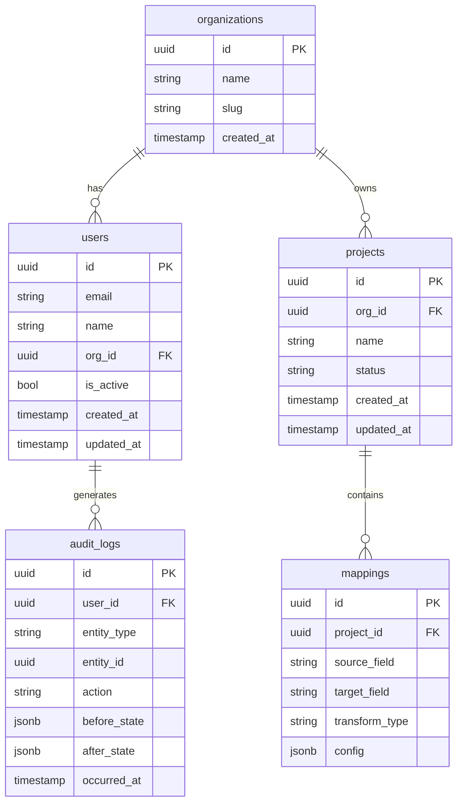

# Database ERD

> [!info] Context
> A database schema diagram showing tables, columns, types, and relationships. Use for database design, EF Core schema review, or data modeling.

## Diagram

## Notes

- Rename tables and columns to match your schema
- Use PK/FK markers for primary and foreign keys
- Relationship syntax: `||--o{` (one-to-many), `||--||` (one-to-one), `}o--o{` (many-to-many)
- Add/remove tables as needed
