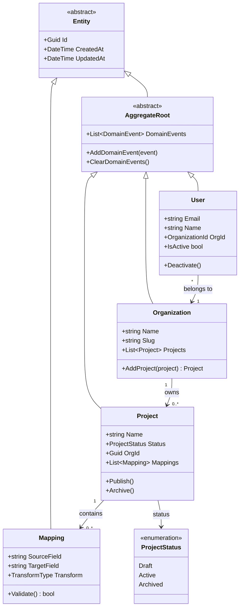

# Domain Model — Class Diagram

> [!info] Context
> A Clean Architecture domain model showing entities, aggregate roots, value objects, and enums. Use for EF Core models, DDD aggregates, or any OOP structure.

## Diagram

## Notes

- Rename entities to match your domain
- Add/remove properties and methods as needed
- Use `<<abstract>>` for base classes and `<<enumeration>>` for enums
- Relationship syntax: `"1" --> "0..*"` for cardinality
