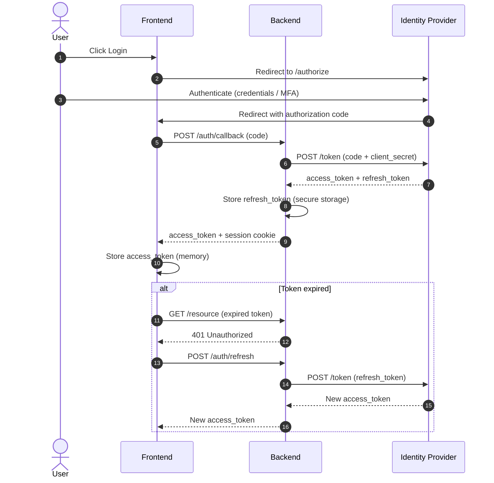

# Auth / Login Flow — Sequence Diagram

> [!info] Context
> An OAuth2/OIDC authorization code flow with token refresh. Use for documenting authentication flows, SSO integrations, or API authorization patterns.

## Diagram

## Notes

- Swap IdP name to match your provider (Auth0, Okta, Keycloak, etc.)
- Add `Note over` blocks to annotate security considerations
- See [[reference/sequence-snippet-kit|Sequence Snippet Kit]] for more patterns
