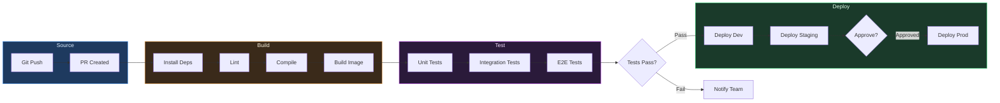

# CI/CD Pipeline

> [!info] Context
> A CI/CD pipeline showing build, test, and deploy stages across environments. Use for documenting GitHub Actions, GitLab CI, Jenkins, or any deployment pipeline.

## Diagram

## Notes

- Add/remove stages to match your pipeline
- Add approval gates with decision diamonds
- Customize environment names (dev/staging/prod)
- Add parallel paths for independent test suites
