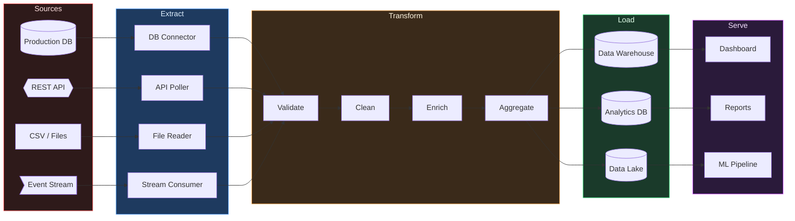

# ETL / Data Flow Pipeline

> [!info] Context
> An ETL (Extract, Transform, Load) pipeline showing data movement from source systems through processing to a data warehouse. Use for documenting data engineering pipelines, analytics workflows, or data migration flows.

## Diagram

## Notes

- Add/remove sources and destinations as needed
- Add error handling paths (dead letter queues, retry logic)
- Customize transformation steps for your pipeline
- Add scheduling annotations for batch vs streaming
