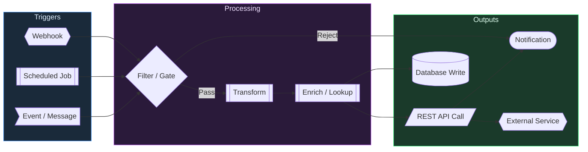

# Event / Integration Pipeline

> [!info] Context
> An event-driven pipeline diagram for n8n workflows, webhooks, automation, or any integration flow. Direction is left-to-right since pipelines read naturally that way.

## Diagram

## Notes

- Add/remove triggers, processors, and outputs as needed
- Use edge labels (`-->|label|`) to annotate conditional paths
- Swap subgraph names to match your pipeline stages
