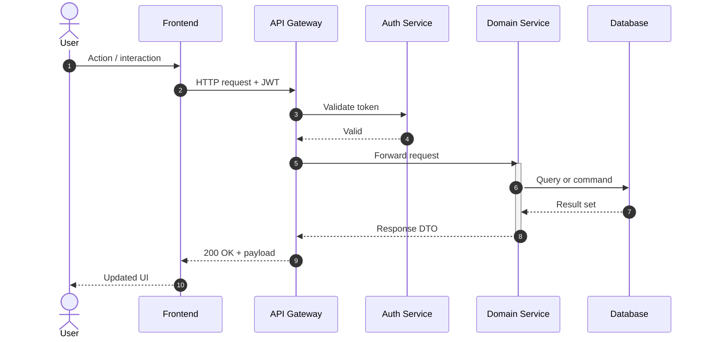

# Request Lifecycle — Sequence Diagram

> [!info] Context
> A standard HTTP request flow through a layered API showing authentication, domain logic, and database interaction. Swap actor and participant names to match your stack.

## Diagram

## Notes

- Swap participant names (FE, GW, AUTH, SVC, DB) to match your services
- Add `alt`/`else` blocks for error paths
- Add `loop` blocks for retry logic
- See [[reference/sequence-snippet-kit|Sequence Snippet Kit]] for more patterns
