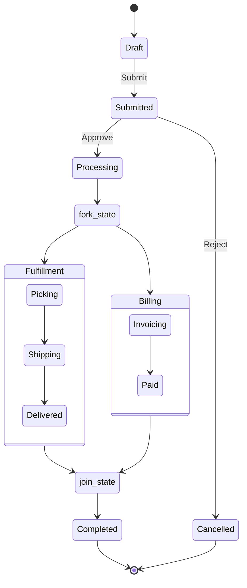

# State Diagram

> [!info] Context
> A generic state machine for modeling workflows, order lifecycles, CI/CD pipelines, or any process with defined states and transitions. Customize states and transitions to match your domain.

## Diagram

## Notes

- Replace states and transitions to match your domain
- Use `<<fork>>` and `<<join>>` for parallel processing
- Use `<<choice>>` for conditional transitions
- Add notes with `note right of StateName: description`
- Mermaid state diagrams have limited styling support compared to flowcharts
