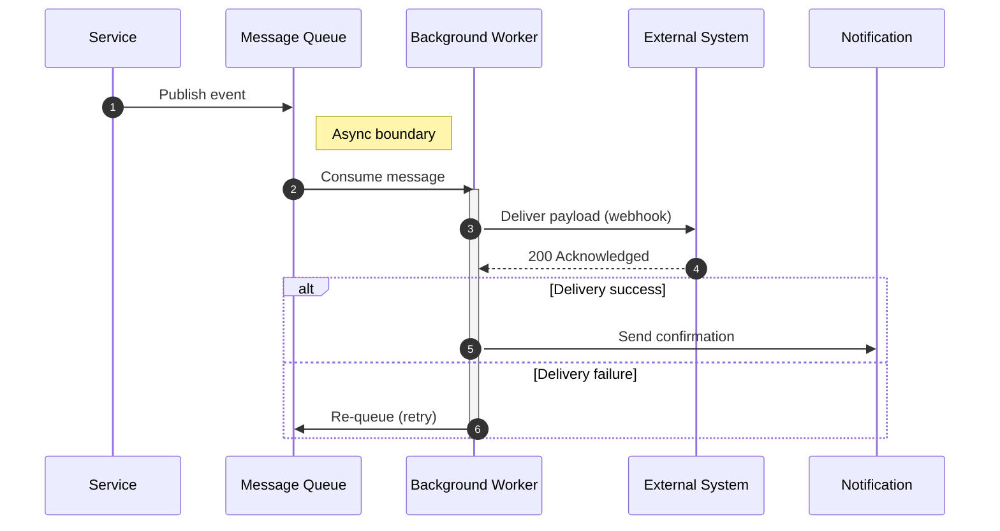

# Webhook / Async Flow — Sequence Diagram

> [!info] Context
> An asynchronous processing pattern showing event publishing, message consumption, webhook delivery, and retry logic. Use for outbound webhooks, event-driven architectures, or background job flows.

## Diagram

## Notes

- Add retry count limits with `loop Retry (max N)` blocks
- Add dead-letter queue handling for permanent failures
- Customize participant names to match your infrastructure
