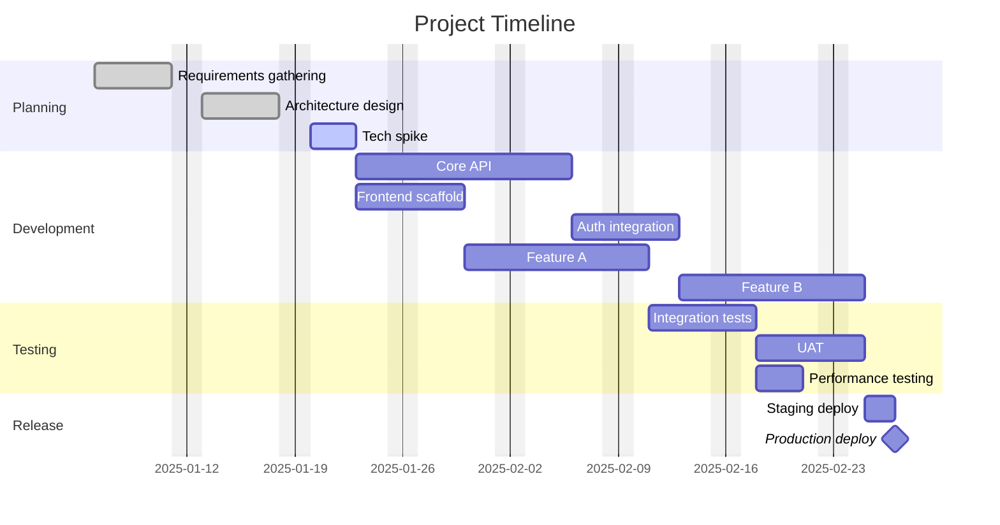

# Gantt Chart

> [!info] Context
> A Mermaid Gantt chart for project planning, sprint scheduling, or release timelines. Customize tasks, dates, and dependencies to match your project.

## Diagram

## Notes

- Use `done`, `active`, or `crit` to mark task status
- Use `after taskId` for dependencies
- Use `milestone` for zero-duration milestone markers
- `excludes weekends` skips Saturdays and Sundays
- Customize `dateFormat` as needed (YYYY-MM-DD is default)
