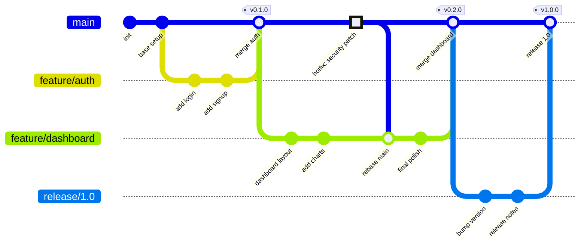

# Git Branching Strategy

> [!info] Context
> A Mermaid gitgraph showing branching patterns. Use for documenting your team's branching strategy, release process, or Git workflow conventions.

## Diagram

## Notes

- Use `branch`, `checkout`, `commit`, and `merge` to model your workflow
- Add `tag:` to mark releases
- Use `type: HIGHLIGHT` for important commits (hotfixes, breaking changes)
- Adapt to your strategy: trunk-based, gitflow, GitHub flow, etc.
- Mermaid gitgraph has limited styling — focus on illustrating the branching model
