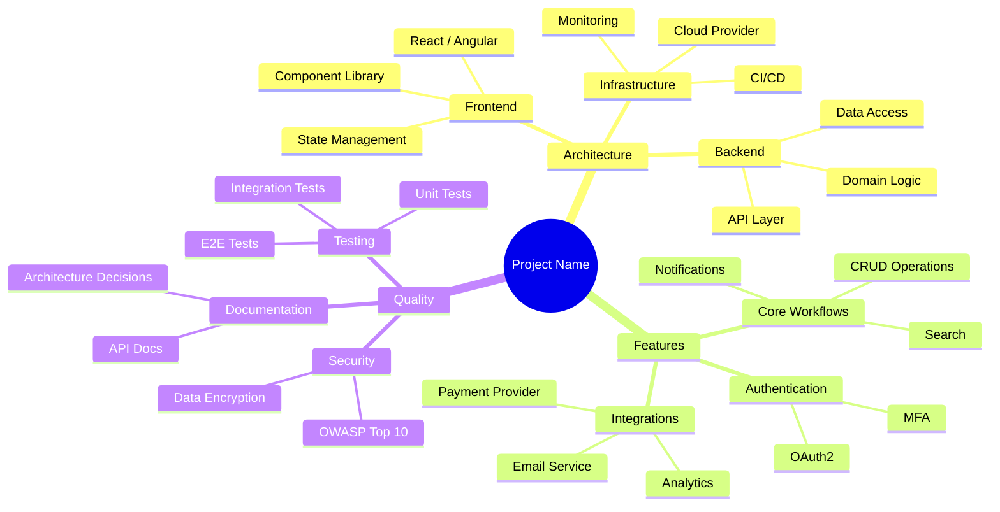

# Mindmap

> [!info] Context
> A Mermaid mindmap for brainstorming, knowledge organization, or feature decomposition. Use as a starting point for exploring ideas in Obsidian.

## Diagram

## Notes

- Mermaid mindmaps render natively in Obsidian — no plugin needed
- Indent with spaces to create hierarchy
- Use `((text))` for rounded root, `(text)` for rounded nodes, `[text]` for square nodes
- Mindmaps have limited styling — focus on structure over appearance
