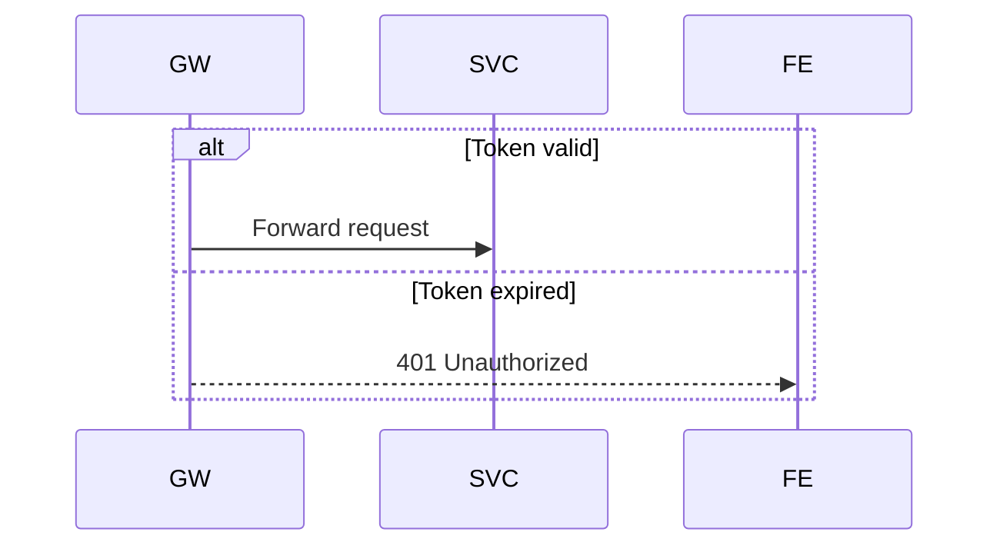
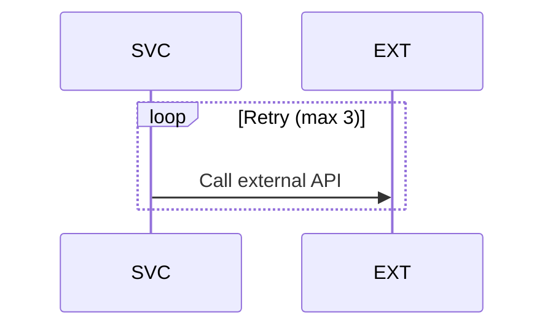
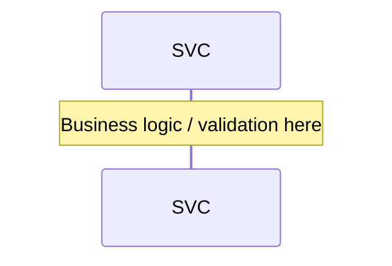

# Sequence Diagram — Snippet Kit

> [!info] Context
> Copy-paste snippets for enhancing Mermaid sequence diagrams. Drop these blocks into any sequence diagram to add conditionals, loops, annotations, and highlighted sections.

## Conditional Branch

Use `alt`/`else` for if/else logic in a sequence:

## Retry Loop

Use `loop` for repeated attempts:

## Annotation

Use `Note` to add context to a participant:

## Highlighted Section

Use `rect` to visually group critical operations:

```mermaid
sequenceDiagram
    rect rgb(30, 50, 30)
        SVC->>DB: Critical transaction
        DB-->>SVC: Commit
    end
```

