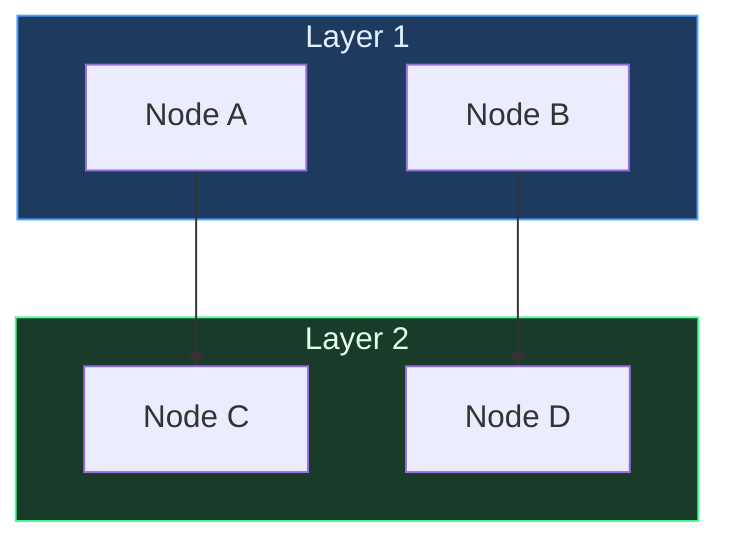

# Blank Mermaid Starter

> [!info] Context
> A minimal Mermaid flowchart with the project color palette applied. Replace the placeholder nodes and customize.

## Diagram

## Notes

- Rename subgraphs and nodes to match your system
- See [[reference/color-palette|Color Palette]] for all available colors
- See [[reference/shape-reference|Shape Reference]] for node shape syntax
