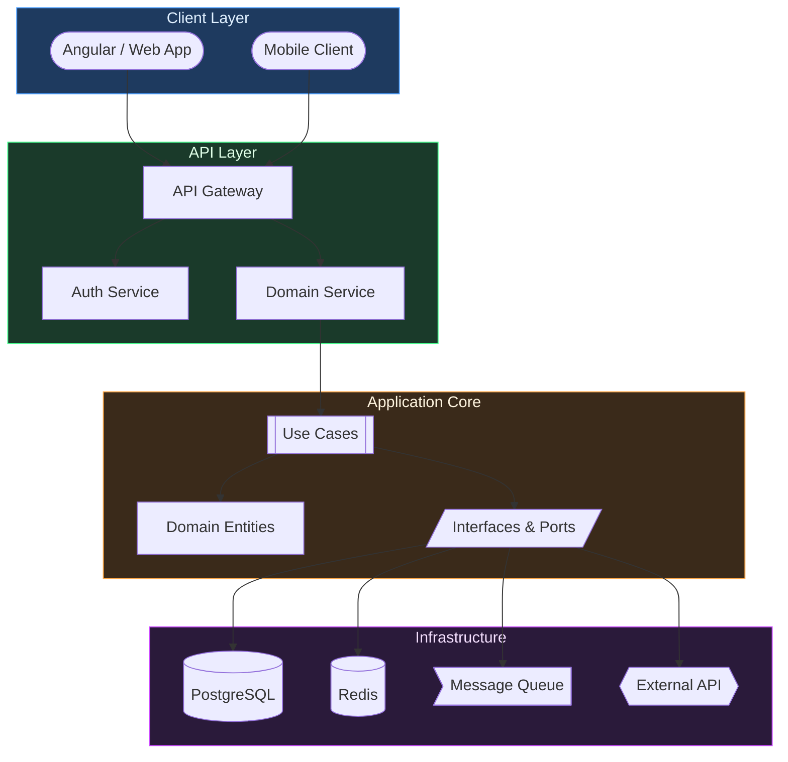

# System Overview Flowchart

> [!info] Context
> A layered system architecture diagram in Clean Architecture style. Shows client, API, core, and infrastructure layers with their relationships.

## Diagram

## Notes

- Blue — Client / Presentation
- Green — API / Application
- Amber — Domain / Core
- Purple — Infrastructure / Data
- Swap node names and add/remove layers to match your system
